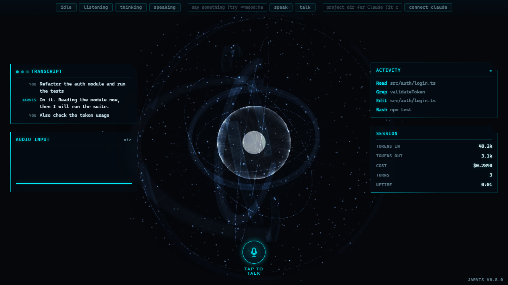

# Jarvis

A standalone desktop app (Tauri v2) that is the voice and face of Claude Code. Speak a
request; a glowing holographic orb listens, shows Claude thinking, and speaks the reply
back, while a futuristic HUD streams the live transcript, the tools Claude is running,
token and cost telemetry, and your microphone waveform. Speech runs entirely on-device
(local Whisper for recognition, native Windows synthesis for the voice), and the `claude`
CLI drives real coding sessions in a project directory you choose.



It was built as a native app specifically to leave the browser-overlay era behind: no more
injecting into someone else's page, no browser speech-recognition lottery, and no
PowerShell or antivirus friction. The four-state avatar and the small voice seam are
preserved; the shell is now a real window.

## What it does

- **Hands-free voice loop:** speak, auto-send on pause, Claude works, spoken reply with
  mood, back to listening.
- **Four reactive states** driven by real voice signals: Idle, Listening, Thinking, Speaking.
- A **holographic Jarvis orb** (Three.js) centerpiece on a three-column tactical HUD; the
  orb shifts color with both the activity state and the mood.
- **Four live telemetry panels**, fed by the voice loop:
  - **Transcript** (you and Jarvis)
  - **Activity** (each tool Claude runs this turn: Read, Edit, Bash, ...)
  - **Session** (accumulated tokens in/out, cost, turns, uptime)
  - **Audio** (a live oscilloscope of your microphone)
- A **mood layer**: Claude emits a tiny `<<mood:NAME>>` tag that tints the orb and is always
  stripped before it is spoken or shown. See [Mood](#mood).
- **Local and low-cost:** speech recognition and synthesis run on-device with no cloud
  speech and no CDN; Claude itself runs through your existing `claude` login.

## The four states (and mood on top)

| State | Behavior |
| --- | --- |
| Idle | Slow orbital drift; calm navy and slate baseline. |
| Listening | The orb energizes to your live mic level; brighter cyan. |
| Thinking | Faster rotation and higher energy while Claude works. |
| Speaking | The core flares on each word; intense bright blue. |

Activity owns the motion; mood owns a color tint on top (neutral is a pass-through, so with
no mood tag the avatar behaves exactly as the four states above).

## How it works (the voice loop)

- **STT:** the webview captures the microphone; a Rust worker runs local Whisper
  (`whisper-rs`) with `webrtc-vad` endpointing, so an utterance auto-finalizes on a pause.
  Genuinely offline. The speech model downloads once on first run.
- **TTS:** a Rust command synthesizes speech to a WAV buffer with native Windows SAPI
  (in-process, no `powershell.exe`), played through Web Audio so the real audio amplitude
  drives the Speaking animation.
- **Claude bridge:** Rust drives the `claude` CLI as a long-lived sidecar
  (`--print --input-format stream-json --output-format stream-json`), parses its NDJSON
  events into avatar states and the telemetry panels, and pushes each finalized utterance as
  the next user message.

The seam stays small and host-neutral:
`VoiceSignals { micActive, speaking, pendingResponse } -> deriveState() -> AvatarController`
(priority: speaking > listening > thinking > idle).

## Run it

Prerequisites: Node 20+, a Rust toolchain, and LLVM/libclang (needed to build `whisper-rs`).
The `claude` CLI must be on your PATH at runtime. Windows is the primary platform (native
SAPI TTS).

```bash
npm install

# Dev: launches the native window with the full voice loop.
# Set LIBCLANG_PATH so whisper-rs can build.
LIBCLANG_PATH="C:/Program Files/LLVM/bin" npm run tauri dev
```

Build a standalone app you can launch from the Start menu:

```bash
LIBCLANG_PATH="C:/Program Files/LLVM/bin" npm run tauri build
```

This produces an unsigned per-user NSIS installer (`Jarvis_<version>_x64-setup.exe`) plus the
raw `app.exe`, under the configured target directory. It is unsigned by design (a private,
personal, zero-cost tool), so Windows SmartScreen shows a one-time "More info, Run anyway."

A host-free **demo** (no Tauri, no backend) exercises the avatar states in a browser:

```bash
npm run dev   # opens http://127.0.0.1:5173/demo/
```

## Mood

Have your Claude session begin each spoken reply with a marker:

```
<<mood:NAME>>
```

`NAME` is one of `neutral`, `focused`, `happy`, `concerned`, `error`, `curious`. The orb reads
the mood and **always strips every marker** before it is spoken or shown, so a stray tag is
silently removed. With no tag it stays neutral. Add the one-line convention to your project's
`CLAUDE.md` to enable it.

## Architecture

```
src/
  app/                     Desktop shell: main.ts entry, shell.css (the FUI HUD), index.html
  avatar/
    JarvisOrbAvatar.ts     Adapter: drives the orb through the ControllableAvatar seam
    jarvisOrb/             Vendored MIT Three.js orb (renderer.ts + states.ts; see its LICENSE)
    AvatarController.ts    idle|listening|thinking|speaking state machine
    Avatar.ts, reactor.ts, shaders.ts, gltf.ts, noise.ts, deformation.ts   (demo renderers)
  audio/                   MediaTts (WAV playback + amplitude), SttCapture, MicAnalyser, bands
  integration/
    tauriAdapter.ts        The voice seam: Tauri events -> signals -> controller; TTS/STT/Claude
    telemetry.ts           The four live HUD panels (transcript / activity / session / waveform)
    signals.ts             Pure VoiceSignals -> deriveState
  mood/                    mood tag parser, color blend, MoodController
  config/                  AvatarConfig + safe localStorage store
demo/                      Host-free harness (the legacy Three.js reactor/head + all states)

src-tauri/                 Rust backend
  src/tts.rs               Native Windows SAPI synth -> WAV buffer (no PowerShell)
  src/stt.rs               Mic frames -> webrtc-vad endpointing -> whisper-rs transcription
  src/claude.rs            The claude CLI stream-json sidecar + event parsing
  tauri.conf.json          Window, strict CSP, NSIS bundle
```

The desktop frontend imports the TypeScript source through Vite; the demo at `/demo/` is the
host-free harness and the primary Vitest/Playwright surface. The orb is a vendored, self-contained
Three.js renderer wrapped by a thin adapter, so the four-state controller, mood layer, and the
entire voice loop drive it with no changes.

## Security

- The Claude child runs with `--permission-mode dontAsk` plus an explicit `--allowedTools`
  allowlist (the standard coding toolset) and a `--disallowedTools` denylist of catastrophic
  shell commands. It is **never** `bypassPermissions`: anything off the allowlist is denied,
  and the Activity panel shows every tool as it runs. The chosen project directory is the
  intended blast radius (this is defense-in-depth, not an OS sandbox).
- A strict **Content-Security-Policy** (no remote origins; the only egress is the `claude`
  child and the checksummed model download done in Rust).
- A **Thinking watchdog** recovers the UI if a Claude turn hangs.
- Native SAPI TTS runs **in-process** (no `powershell.exe` child), which removes the antivirus
  friction the old browser path hit.
- `getUserMedia` is audio-only, least-privilege, and cancellation-safe; the `<<mood:...>>`
  parser is bounded, and all rendered text uses `textContent` (never `innerHTML`).
- No API key is stored (the app uses your existing `claude` login); `npm audit` is clean.

## Scripts

| Command | Purpose |
| --- | --- |
| `npm run tauri dev` | Native window + full voice loop (set `LIBCLANG_PATH`) |
| `npm run tauri build` | Unsigned per-user NSIS installer + `app.exe` |
| `npm run dev` | Vite dev server + host-free demo at `/demo/` |
| `npm test` | Vitest unit tests |
| `npm run test:e2e` | Playwright Chromium e2e (run `npm run e2e:install` once first) |
| `npm run lint` / `npm run typecheck` | ESLint / `tsc --noEmit` |
| `cargo test` (in `src-tauri`) | Rust backend tests (set `LIBCLANG_PATH`) |

## Tests

155 unit tests (state machine, mood parse/blend/controller, FFT bands, mic, MediaTts, the
telemetry formatters and panels, the Thinking watchdog, the demo renderers and GLTF pipeline)
plus Playwright e2e specs that boot the app and the demo, assert a live WebGL canvas, cycle all
four states, and check the telemetry panels. Rust unit tests cover the stream-json parsing and
the TTS/STT helpers. `npm audit` is clean.

## Tech stack

TypeScript, Three.js, Vite, Vitest, and Playwright on the frontend; Tauri v2 with a Rust
backend (`whisper-rs`, `webrtc-vad`, the `windows` crate for SAPI, `tokio` + `serde_json` for
the Claude sidecar); and the `claude` CLI for the agent itself. Windows is the primary platform;
the avatar and the voice seam are platform-independent.

## Acknowledgements

- The holographic orb is the MIT-licensed
  [`jarvis-ai-orb-web-animation`](https://github.com/cyber1443/jarvis-ai-orb-web-animation) by
  cyber1443, vendored under `src/avatar/jarvisOrb/` (its renderer ported to Three.js r128).
- The demo's head model is the Lee Perry-Smith head (CC-BY 3.0), swappable via config; see
  `vendor/NOTICE.md`.
