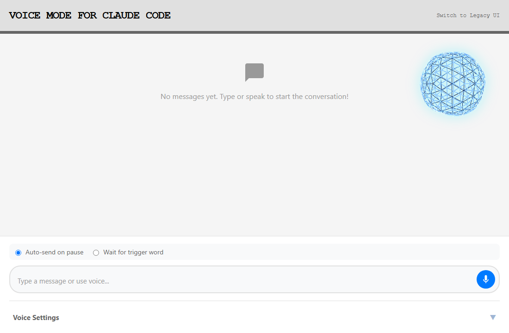
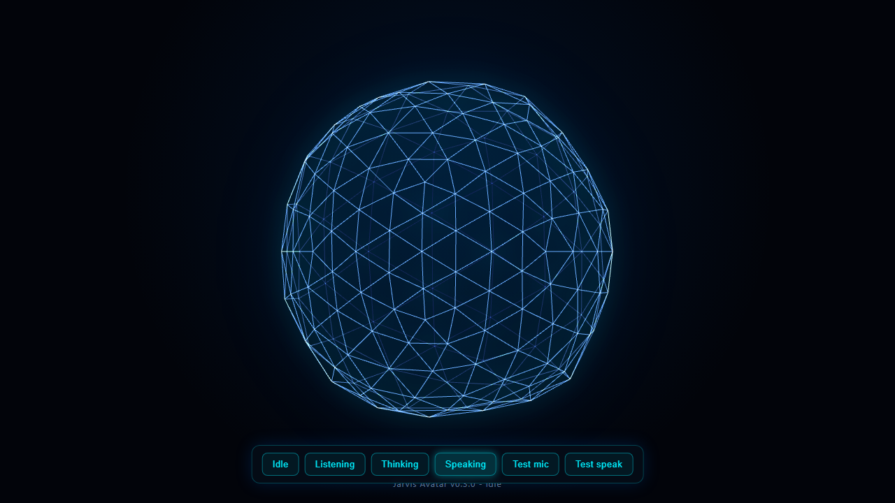
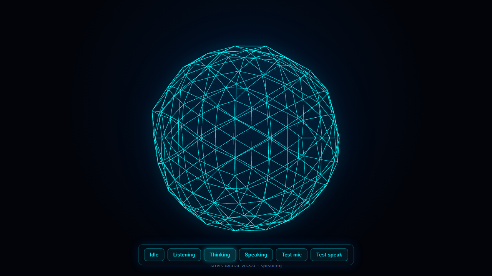

# Jarvis Avatar

A real-time 3D neon "Jarvis" avatar overlay for the
[mcp-voice-hooks](https://github.com/johnmatthewtennant/mcp-voice-hooks) Voice Mode UI for
Claude Code. A glowing wireframe orb that breathes while idle, reacts to your microphone
while you speak, pulses while Claude is thinking, and deforms to Claude's speech cadence
while it replies. Everything runs 100% locally through the browser's Web Speech API, with
zero added API cost.



## Features

- Real-time Three.js wireframe icosahedron with a fresnel neon glow (cyan/blue).
- Four reactive states driven by real voice signals: Idle, Listening, Thinking, Speaking.
- Mic-driven amplitude via `AnalyserNode` for Listening; word-boundary impulses (plus a
  synthetic envelope fallback) for Speaking.
- 100% local: browser STT/TTS, Three.js vendored locally (no runtime CDN).
- An idempotent, reversible, path-safe injector that drops the avatar into the
  `mcp-voice-hooks` page without forking it.
- A standalone demo to play with all four states without the voice stack.

## The four states

| State | Behavior (AVATAR_SPEC section 4) |
| --- | --- |
| Idle | Slow ambient breathing and rotation; dark navy/slate spectrum. |
| Listening | Vertical compression driven by live microphone amplitude. |
| Thinking | Rapid pulsing with an orbital rotation pattern. |
| Speaking | Word-boundary displacement impulses with an intense bright-blue glow. |

| Idle | Speaking |
| --- | --- |
|  |  |

## Quick start (standalone demo)

```bash
npm install
npm run dev
```

Opens `http://127.0.0.1:5173/demo/` with a control panel: buttons for each state, a real
microphone test (Listening), and a real speech-synthesis test (Speaking).

## Wire it into the live mcp-voice-hooks UI

`mcp-voice-hooks` serves its browser UI on `http://localhost:5111`. To overlay the avatar:

```bash
# 1. install the voice tool (its server serves public/index.html on :5111)
npm install -g mcp-voice-hooks

# 2. build the injectable bundle (dist/avatar.js + dist/avatar.css)
npm run build:lib

# 3. inject the avatar into the installed UI (idempotent + reversible)
npm run inject -- --path "<path-to>/mcp-voice-hooks/public/index.html"
```

The injector backs up the original `index.html`, copies `avatar.js` / `avatar.css` /
`three.min.js` next to it, and inserts a single marked `<script>` block. Undo at any time
with `npm run inject:revert -- --path <same path>`.

For the full voice-to-Claude loop, register `mcp-voice-hooks` with Claude Code (see its
README) and restart Claude Code; the avatar then rides on the real Voice Mode UI.

> Platform note: `mcp-voice-hooks` is macOS-oriented. The avatar overlay and browser
> STT/TTS work on Windows with Chrome, but system TTS (`say`) is mac-only and the delivery
> hooks use shell-style commands. The avatar itself is platform-independent.

## Architecture

```
src/
  index.ts                       Public API barrel (ESM, imported by the demo)
  bundle.ts                      IIFE entry -> global JarvisAvatar + host auto-attach
  avatar/Avatar.ts               Renderer / scene / camera / mesh / loop / resize / dispose
  avatar/AvatarController.ts     idle|listening|thinking|speaking state machine
  avatar/noise.ts                Deterministic 3D Perlin noise (pure, tested)
  avatar/deformation.ts          Bounded vertex-displacement math (pure, tested)
  avatar/shaders.ts              Neon wireframe + fresnel-glow GLSL
  audio/MicAnalyser.ts           getUserMedia -> AnalyserNode -> level (Listening)
  audio/SpeechReactor.ts         speechSynthesis onboundary impulses (Speaking)
  integration/voiceHooksAdapter  Maps host voice signals to avatar states
demo/                            Standalone four-state harness
scripts/inject.mjs               Injector CLI (+ pure core in injector-core.mjs)
vendor/three.min.js              Vendored Three.js r128 (global THREE)
```

The demo imports the TypeScript source directly through Vite. The injected artifact is a
global IIFE (`dist/avatar.js`) with `three` external and bound to the vendored global
`THREE`, so the same Three.js version runs at dev, test, and runtime.

Two deliberate deviations from a literal reading of the spec: Three.js is vendored locally
rather than loaded from a CDN, and Speaking is driven by `onboundary` word events rather
than by analysing the TTS audio (browser `speechSynthesis` output cannot be routed into an
`AnalyserNode`). The real microphone path does use a live `AnalyserNode` for Listening.

## Scripts

| Command | Purpose |
| --- | --- |
| `npm run dev` | Vite dev server + standalone demo |
| `npm run build:lib` | Build `dist/avatar.js` and `dist/avatar.css` |
| `npm test` | Vitest unit tests |
| `npm run test:e2e` | Playwright Chromium smoke (run `npm run e2e:install` once first) |
| `npm run lint` / `npm run typecheck` | ESLint / `tsc --noEmit` |
| `npm run inject` / `npm run inject:revert` | Inject / revert into a host page |

## Security

- Vendored dependencies only; no runtime CDN, remote fetch, or `eval`.
- Injector validates the path (rejects null bytes, non-`index.html`, and symlinks),
  sentinel-verifies the target, backs up before writing, and is idempotent and reversible.
- `getUserMedia` is audio-only and least-privilege; tracks are released on stop and the
  start path is cancellation-safe so a stop during the permission prompt cannot leak the mic.
- Patches of `speechSynthesis` / `SpeechRecognition` restore only if still owned (never
  clobber a later patcher) and refuse to double-wrap.
- Any host or user text rendered to the DOM uses `textContent`, never `innerHTML`.

## Tests

65 unit tests (noise, deformation, state machine, mic, speech reactor, adapter, injector)
plus a Playwright end-to-end smoke that boots the demo, asserts a live WebGL canvas, and
cycles all four states. `npm audit` is clean.

## Tech stack

TypeScript, Three.js r128, Vite, Vitest, Playwright, ESLint.

## Acknowledgements

Built on top of [mcp-voice-hooks](https://github.com/johnmatthewtennant/mcp-voice-hooks)
by John Tennant, which provides the browser-native voice bridge for Claude Code.
