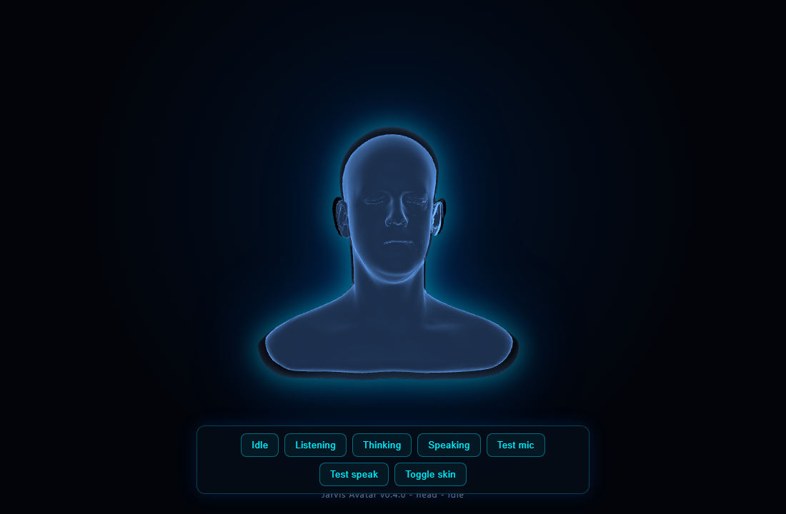

# Jarvis Avatar

A real-time 3D "Jarvis" avatar that becomes the voice and face of Claude Code, overlaid on
the [mcp-voice-hooks](https://github.com/johnmatthewtennant/mcp-voice-hooks) Voice Mode UI.
A glowing humanoid head that breathes while idle, compresses to your microphone while you
speak, pulses while Claude is thinking, deforms to Claude's speech while it replies, and
shifts color to match the mood of what Claude is saying. Everything runs 100% locally
through the browser's Web Speech API, with zero added API cost.



## Features

- A solid **glowing humanoid head** (loaded from a vendored GLB) with a fresnel core and a
  soft additive **halo glow shell**, rendered on a transparent canvas so the host page shows
  through. A legacy neon **wireframe orb** is kept as a switchable skin.
- **Four reactive states** driven by real voice signals: Idle, Listening, Thinking, Speaking.
- A **mood layer**: Claude emits a tiny `<<mood:NAME>>` tag that the avatar reads (and always
  strips, so it is never spoken or shown) and maps to color/glow, layered on top of the
  activity states. Runs off your Claude account, zero extra cost. See [Mood](#mood) below.
- **Richer listening**: live microphone FFT split into log-spaced frequency bands (bass drives
  the compression, treble adds shimmer), not just a single amplitude.
- 100% local: browser STT/TTS, Three.js (and the GLTF loader) vendored locally, no runtime CDN.
- An idempotent, reversible, path-safe **injector** that drops the avatar into the
  `mcp-voice-hooks` page without forking it.
- Accessibility: respects `prefers-reduced-motion`; a live status region announces state.
- A standalone **demo** to exercise every state, the mic, speech, and the skin toggle without
  the voice stack.

## The four states (and mood on top)

| State | Behavior |
| --- | --- |
| Idle | Slow ambient breathing and a gentle forward-facing sway; calm baseline glow. |
| Listening | Vertical compression driven by live mic FFT bands; brighter cyan. |
| Thinking | Rapid pulsing with an orbital tilt; faster motion. |
| Speaking | Word-boundary displacement impulses with an intense bright-blue glow. |

The activity state owns the motion; the **mood** owns a color tint and glow adjustment on top
(neutral is a pass-through, so with no mood tag the avatar behaves exactly as the four states
above).

## Quick start (standalone demo)

```bash
npm install
npm run dev
```

Opens `http://127.0.0.1:5173/demo/` with a control panel: a button for each state, a real
microphone test (Listening), a real speech-synthesis test (Speaking), and a skin toggle
(glowing head <-> neon orb).

## Wire it into the live mcp-voice-hooks UI

`mcp-voice-hooks` serves its browser UI on `http://localhost:5111`. To overlay the avatar:

```bash
# 1. install the voice tool globally (its server serves public/index.html on :5111)
npm install -g mcp-voice-hooks

# 2. build the injectable bundle (dist/avatar.js + dist/avatar.css)
npm run build:lib

# 3. inject into the installed UI (auto-discovers %APPDATA%/npm or set --path; reversible)
npm run inject
```

The injector backs up the original `index.html`, copies the avatar bundle plus the vendored
`three.min.js`, `GLTFLoader.js`, and the head model `head.glb` next to it, and inserts a single
marked `<script>` block in dependency order. Undo at any time with `npm run inject:revert`.

To use it in a coding session, in your project folder run `mcp-voice-hooks install-hooks` and
register the MCP **pointed at your global install** (the one with the avatar injected), then
start Claude Code; the UI opens on `:5111` after a few seconds with the head live. Use Chrome
for browser STT/TTS.

> Platform note: `mcp-voice-hooks` is macOS-oriented. The avatar overlay and browser STT/TTS
> work on Windows with Chrome, but system TTS (`say`) is mac-only. The avatar itself is
> platform-independent. The mood tag is stripped on the browser-voice path (and in the
> transcript); the macOS `system` voice path is not stripped, so use a browser voice for mood.

## Mood

When voice mode is active, have your Claude session begin each spoken reply with a marker:

```
<<mood:NAME>>
```

`NAME` is one of `neutral`, `focused`, `happy`, `concerned`, `error`, `curious`. The avatar
reads the mood and **always strips every marker** before it is spoken or shown, so a stray tag
is silently removed. With no tag the avatar stays neutral (full functionality, no regression).
Add the one-line convention to your project's `CLAUDE.md` to enable it. An optional Claude API
tone-analysis path is designed behind a `127.0.0.1` helper (key never in the browser) and is
off by default; the tag path is the free default.

## Architecture

```
src/
  index.ts                       Public API barrel (ESM, imported by the demo)
  bundle.ts                      IIFE entry -> global JarvisAvatar + host auto-attach (head + loader)
  config/                        AvatarConfig + DEFAULT_CONFIG; safe localStorage store
  avatar/Avatar.ts               Renderer/scene/camera/mesh, fallback-then-swap geometry, halo, loop
  avatar/AvatarController.ts     idle|listening|thinking|speaking + mood/FFT-band integration
  avatar/gltf.ts                 Injected GLTF loader: extract/normalize/load head geometry
  avatar/shaders.ts              Fresnel head, neon wireframe, and halo-glow GLSL
  avatar/noise.ts, deformation.ts  Deterministic Perlin noise + bounded displacement (pure)
  audio/MicAnalyser.ts, bands.ts  getUserMedia -> AnalyserNode -> level + log-spaced FFT bands
  audio/SpeechReactor.ts         speechSynthesis boundary impulses + mood-tag strip hook
  mood/                          moods, tolerant marker parser, color blend, MoodController
  integration/voiceHooksAdapter  Wires voice signals, mood, transcript observer, resize
  integration/transcriptMoodObserver.ts  Strips mood tags from the rendered transcript (text nodes only)
demo/                            Standalone harness (head + all states + skin toggle)
scripts/inject.mjs               Injector CLI (+ pure core in injector-core.mjs)
vendor/                          Vendored three.min.js (r128), GLTFLoader.js, head.glb (see NOTICE.md)
```

The demo imports the TypeScript source directly through Vite. The injected artifact is a global
IIFE (`dist/avatar.js`) with `three` external and bound to the vendored global `THREE`, so the
same Three.js version runs at dev, test, and runtime. The head GLB is loaded with a
fallback-then-swap lifecycle (the orb shows instantly while the head loads, then the head is
adopted atomically; a load failure keeps the orb).

Notable engineering notes: Three.js and the GLTF loader are vendored locally rather than loaded
from a CDN; Speaking is driven by `speechSynthesis` word-boundary events (browser TTS output
cannot be routed into an `AnalyserNode`), while Listening uses a real mic `AnalyserNode`; and
post-processing **bloom was tried but reverted** because at r128 it forces the overlay canvas
opaque (verified in a browser), so the glow is the in-shader fresnel plus a transparency-safe
additive halo shell instead (see `docs/spikes.md`).

## Scripts

| Command | Purpose |
| --- | --- |
| `npm run dev` | Vite dev server + standalone demo |
| `npm run build:lib` | Build `dist/avatar.js` and `dist/avatar.css` |
| `npm run vendor:three` | Re-vendor `three.min.js` + `GLTFLoader.js` from node_modules |
| `npm test` | Vitest unit tests |
| `npm run test:e2e` | Playwright Chromium e2e (run `npm run e2e:install` once first) |
| `npm run lint` / `npm run typecheck` | ESLint / `tsc --noEmit` |
| `npm run inject` / `npm run inject:revert` | Inject / revert into a host page |

## Security

- Vendored dependencies only; no runtime CDN, remote fetch, or `eval`.
- Injector validates the path (rejects null bytes, non-`index.html`, and symlinked targets or
  parent directories), sentinel-verifies the target, backs up before writing, and is idempotent
  and fully reversible (including the copied GLB and loader assets).
- The mood transcript observer edits text nodes only (never `innerHTML`), is XSS-safe and
  idempotent, and disconnects on dispose; the marker parser is bounded (no catastrophic
  backtracking). Any optional API key is never stored (only a presence flag).
- `getUserMedia` is audio-only and least-privilege; tracks are released on stop and the start
  path is cancellation-safe so a stop during the permission prompt cannot leak the mic.
- Patches of `speechSynthesis` / `SpeechRecognition` restore only if still owned and refuse to
  double-wrap. The head load is generation-token guarded so a stale/late load cannot clobber a
  newer skin or mutate a disposed avatar.

## Tests

129 unit tests (config + store, GLTF pipeline, geometry lifecycle and disposal, head shader and
halo, mood parsing/blend/controller, FFT bands, mic, speech reactor, transcript observer,
adapter teardown, injector) plus Playwright e2e specs that boot the demo, assert a live WebGL
canvas, cycle all four states, and verify the Speak button. `npm audit` is clean.

## Tech stack

TypeScript, Three.js r128 (with the example GLTF loader), Vite, Vitest, Playwright, ESLint.

## Acknowledgements

Built on top of [mcp-voice-hooks](https://github.com/johnmatthewtennant/mcp-voice-hooks) by
John Tennant, which provides the browser-native voice bridge for Claude Code. The default head
model is the Lee Perry-Smith head (CC-BY 3.0); it is swappable via config. See `vendor/NOTICE.md`.
